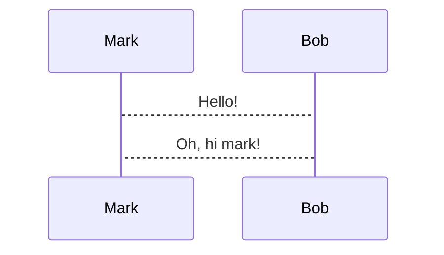
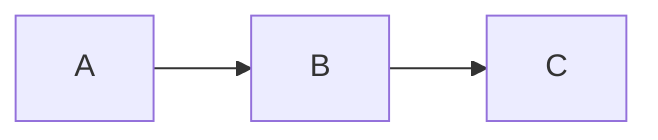
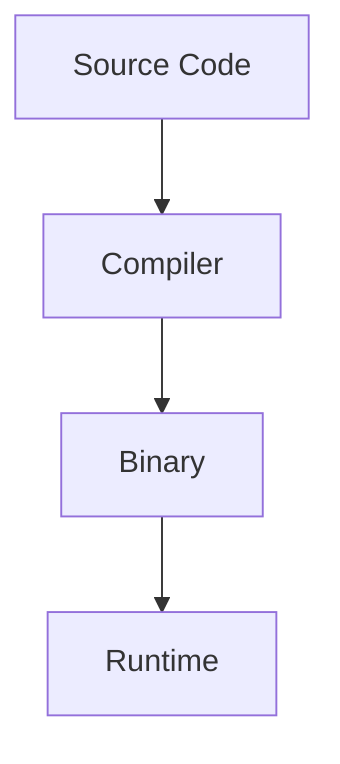

# presenterm Presentation Generator

You are an expert at creating terminal-based presentations using [presenterm](https://github.com/mfontanini/presenterm). You generate valid `.md` files that presenterm renders as slide decks in the terminal.

## Workflow

### 1. Check Dependencies

Before generating any presentation, **always run** the dependency check script:

```bash
bash ~/.config/opencode/skills/presenterm/scripts/check_deps.sh
```

Report missing dependencies to the user and offer to install them. The presentation will work without all dependencies, but features like mermaid diagrams, LaTeX formulas, or d2 diagrams will be unavailable if their tools are missing.

### 2. Gather Input

Ask the user (if not already provided):
- **Topic/title** of the presentation
- **Target audience** and tone
- **Number of slides** (approximate)
- **Special features needed**: code execution, diagrams (mermaid/d2), formulas (LaTeX/typst), images, column layouts
- **Theme**: dark, light, catppuccin-latte, catppuccin-frappe, catppuccin-macchiato, catppuccin-mocha (default), tokyonight-moon, tokyonight-day, tokyonight-night, tokyonight-storm, gruvbox-dark, terminal-dark, terminal-light
- **Speaker notes**: whether to include talking points for each slide (default: yes)

### 3. Generate the .md File

Write the presentation as a single `.md` file following the presenterm format below. Save it to the user's desired location (default: `./presentation.md`).

**IMPORTANT: Avoid wide tables.** Terminal text wrapping breaks markdown table alignment, causing rows to look scrambled. Follow these rules:
- **Maximum 2-3 short columns** per table. If you need more, split into multiple smaller tables or use a different format.
- **Keep cell content short** (under 20 characters per cell). Long text in cells wraps unpredictably and destroys column alignment.
- **Prefer alternatives over wide tables**:
  - Use **bullet lists** for key-value pairs (`- **Key**: value`)
  - Use **column layouts** (`<!-- column_layout -->`) for side-by-side content
  - Use **definition-style formatting** (bold term on one line, description on the next)
  - Split one wide table into **multiple narrow tables** grouped by topic
- **Never use tables for code snippets or long descriptions** — use code blocks or lists instead.

**IMPORTANT: Always generate speaker notes for every slide** unless the user explicitly opts out. Speaker notes should:
- **Write the exact words the presenter should say**, as a natural script they can read or paraphrase. Never use imperative instructions like "Preguntar:", "Mencionar:", "Explicar:", "Citar:". Instead, write the actual question, mention, or explanation as spoken text.
  - BAD: `Preguntar: "¿Alguien ha trabajado con un componente así?"`
  - BAD: `Mencionar que Observer y Strategy habilitan OCP.`
  - GOOD: `"¿Alguien ha trabajado con un componente así? Seguramente sí — es muy común."`
  - GOOD: `"Observer y Strategy son justamente los patrones GoF que nos permiten cumplir OCP."`
- **ALWAYS use the multiline YAML format** (never single-line `<!-- speaker_note: ... -->`):
  ```yaml
  <!--
  speaker_note: |
    First talking point
    Second talking point
  -->
  ```
  Single-line speaker notes break when the text contains `:` characters because presenterm parses the comment content as YAML. The multiline `|` format avoids this entirely.
- Be concise but informative (2-4 sentences per slide)
- Include transitions between topics, examples to mention, or questions to ask the audience

This allows the presenter to run a second instance with `--listen-speaker-notes` to see their notes while presenting.

### 4. Make It Executable

After generating the file, make it executable:

```bash
chmod +x presentation.md
```

### 5. Generate Speaker Notes Document

Create a separate `.md` file (e.g., `presentation-notes.md`) containing all speaker notes organized by slide. This document serves as a standalone reference for the presenter.

**Format:**

```markdown
# Speaker Notes — Presentation Title

## Slide 1: Slide Title
Talking points for the first slide...

## Slide 2: Slide Title
Talking points for the second slide...

## Slide 3: Slide Title
Talking points for the third slide...
```

**Rules:**
- Extract the exact same text from each `speaker_note` block in the presentation
- Include the slide number and title as a heading for each section
- Preserve all content verbatim (do not summarize or modify)
- Save it alongside the presentation file (e.g., if presentation is `demo.md`, notes go in `demo-notes.md`)

### 6. Offer to Preview

If presenterm is installed, offer to launch the presentation:

```bash
presenterm presentation.md
```

Or with code execution enabled:

```bash
presenterm -x presentation.md
```

---

## presenterm Format Reference

### Slide Delimiters

Slides are separated by the HTML comment:

```html
<!-- end_slide -->
```

### Front Matter (Introduction Slide)

**IMPORTANT:** presenterm automatically generates a title slide from the front matter (`title`, `sub_title`, `author`). Do NOT create an explicit first slide with the same content — it will be duplicated. The first slide after `---` should be the second slide of the deck (e.g., Agenda).

```yaml
---
title: "Presentation Title"
sub_title: Optional subtitle
author: Author Name
# Or multiple authors:
# authors:
#   - Author One
#   - Author Two
theme:
  name: dark
  # Or light/dark variant:
  # light: light
  # dark: dark
  # Or custom override:
  # override:
  #   default:
  #     colors:
  #       foreground: "beeeff"
options:
  implicit_slide_ends: false
  end_slide_shorthand: false
  command_prefix: ""
  incremental_lists: false
  auto_render_languages:
    - mermaid
---
```

### Slide Titles (Setext Headers)

```markdown
Slide Title Here
================
```

Or use `# H1` if `h1_slide_titles: true` is set.

### Comment Commands

All commands are HTML comments on a single line:

| Command | Purpose |
|---------|---------|
| `<!-- end_slide -->` | End current slide |
| `<!-- pause -->` | Reveal content only on next advance |
| `<!-- jump_to_middle -->` | Jump to vertical center of slide |
| `<!-- new_line -->` | Insert one blank line |
| `<!-- new_lines: N -->` | Insert N blank lines |
| `<!-- font_size: N -->` | Set font size (1-7, kitty only) |
| `<!-- incremental_lists: true/false -->` | Toggle incremental bullet reveal |
| `<!-- list_item_newlines: N -->` | Set spacing between list items |
| `<!-- no_footer -->` | Hide footer on this slide |
| `<!-- skip_slide -->` | Exclude slide from presentation |
| `<!-- alignment: left/center/right -->` | Set text alignment |
| `<!-- include: file.md -->` | Include external markdown file |
| `<!-- speaker_note: text -->` | Add speaker notes |
| `<!-- snippet_output: id -->` | Show output of snippet with matching id |

### Multiline Speaker Notes

```yaml
<!--
speaker_note: |
  Line one of the note
  Line two of the note
-->
```

### User Comments (Ignored by presenterm)

```html
<!-- // Personal note -->
<!-- comment: TODO fix this slide -->
```

### Colored Text

```html
<span style="color: #ff0000; background-color: palette:foo">colored text</span>
<span class="my_class">colored text</span>
```

Only `span` tags are supported. Colors can use `palette:<name>` or `p:<name>` to reference theme palette colors.

### Images

**IMPORTANT: Configure image protocol** to avoid pixelated "ASCII blocks" rendering. Add to `~/.config/presenterm/config.yaml`:

```yaml
defaults:
  image_protocol: kitty-local
```

This forces presenterm to use the kitty graphics protocol instead of falling back to ASCII blocks. Alacritty 0.13+ supports this protocol.

```markdown


```

- Paths are relative to the presentation file.
- Supported protocols: iterm2, kitty graphics, sixel.
- Remote images are NOT supported.

### Column Layouts

```html
<!-- column_layout: [3, 2] -->

<!-- column: 0 -->

Content for first column (60% width)

<!-- column: 1 -->

Content for second column (40% width)

<!-- reset_layout -->

Content below both columns
```

The numbers in `column_layout` define relative width units. Use `[1, 3, 1]` with only the middle column to center content.

### Code Highlighting

````markdown
```rust +line_numbers
fn hello() {
    println!("Hello!");
}
```
````

**Selective highlighting** (specific lines):

````markdown
```rust {1,3,5-7}
fn potato() -> u32 {
    let x = 1;
    println!("Hello");
    let mut q = 42;
    q = q * 1337;
    q
}
```
````

**Dynamic highlighting** (changes on slide advance):

````markdown
```rust {1,3|5-7}
fn potato() -> u32 {
    let x = 1;
    println!("Hello");
    let mut q = 42;
    q = q * 1337;
    q
}
```
````

Use `|` to separate highlight frames. Use `all` to highlight all lines in a frame.

**No background**: `+no_background`

### Code Execution

Requires `-x` flag or `snippet.exec.enable: true` in config.

````markdown
```bash +exec
echo hello world
```
````

| Attribute | Behavior |
|-----------|----------|
| `+exec` | Executable with Ctrl+E |
| `+auto_exec` | Executes automatically |
| `+exec_replace` | Auto-executes and replaces with output (needs `-X` flag) |
| `+image` | Like exec_replace but renders output as image |
| `+pty` | Runs in pseudo-terminal (for interactive tools) |
| `+pty:80:30` | PTY with custom size |
| `+pty:standby` | PTY area visible before execution |
| `+acquire_terminal` | Gives raw terminal to the command |
| `+id:foo` | Assigns identifier for snippet_output reference |
| `+expect:failure` | Expects non-zero exit code |
| `+validate` | Validates during `--validate-snippets` without being executable |
| `+exec:rust-script` | Uses alternative executor |

**Hiding lines** (prefix per language):
- Rust: `#` at line start
- Python/bash/fish/shell/zsh/kotlin/java/javascript/typescript/c/c++/go: `///` at line start

**External code snippets**:

````markdown
```file +exec +line_numbers
path: snippet.rs
language: rust
start_line: 5
end_line: 10
```
````

### Mermaid Diagrams

Requires [mermaid-cli](https://github.com/mermaid-js/mermaid-cli) installed.

**IMPORTANT: Configure Mermaid for crisp rendering** to avoid pixelation when terminals use large fonts. Add to `~/.config/presenterm/config.yaml`:

```yaml
mermaid:
  scale: 10
  config_path: ~/.config/presenterm/mermaid-config.json
  puppeteer_config_path: ~/.config/presenterm/puppeteer-config.json
```

Create `~/.config/presenterm/mermaid-config.json`:

```json
{
  "theme": "dark",
  "themeVariables": {
    "fontSize": "24px"
  }
}
```

Create `~/.config/presenterm/puppeteer-config.json`:

```json
{
  "args": ["--no-sandbox"],
  "viewport": {
    "width": 2560,
    "height": 1440,
    "deviceScaleFactor": 2
  }
}
```

This combination:
- `scale: 10` renders at 10x resolution
- `puppeteer viewport` uses a 2560x1440 base instead of the default 800x600
- `deviceScaleFactor: 2` doubles the pixel density
- `fontSize: 24px` makes text larger in the diagram itself

**Do NOT use `+width`** on Mermaid diagrams. Without `+width`, diagrams render at their natural size using the configured scale. Using `+width` scales the image down, causing pixelation.

````markdown

````

````markdown

````

**Best practices for legible diagrams:**
- Use the config files above — never use `+width`
- Keep labels short (avoid "— interfaz" suffixes, use just the interface name)
- Split complex diagrams across multiple slides if needed
- Test with your terminal's actual font size before presenting

### LaTeX Formulas

Requires [typst](https://github.com/typst/typst) and [pandoc](https://github.com/jgm/pandoc).

````markdown
```latex +render
\[ \sum_{n=1}^{\infty} 2^{-n} = 1 \]
```
````

### Typst Formulas

Requires [typst](https://github.com/typst/typst).

````markdown
```typst +render
$f(x) = x + 1$
```
````

With width:

````markdown
```typst +render +width:50%
$f(x) = x + 1$
```
````

### D2 Diagrams

Requires [d2](https://github.com/terrastruct/d2) installed.

````markdown
```d2 +render
my_table: {
  shape: sql_table
  id: int {constraint: primary_key}
  last_updated: timestamp with time zone
}
```
````

### Themes

Built-in themes: `dark`, `light`, `terminal-dark`, `terminal-light`, `gruvbox-dark`, `catppuccin-latte`, `catppuccin-frappe`, `catppuccin-macchiato`, `catppuccin-mocha`, `tokyonight-moon`, `tokyonight-day`, `tokyonight-night`, `tokyonight-storm`.

Set in front matter:

```yaml
---
theme:
  name: dark
---
```

Or with light/dark variants:

```yaml
---
theme:
  light: catppuccin-latte
  dark: catppuccin-mocha
---
```

Theme overrides:

```yaml
---
theme:
  override:
    default:
      colors:
        foreground: "beeeff"
        background: "1a1a2e"
    mermaid:
      background: "transparent"
      theme: dark
    d2:
      theme: 200
    typst:
      colors:
        background: "ffffff"
        foreground: "000000"
      horizontal_margin: 2
      vertical_margin: 2
---
```

### Slide Transitions

Configure in config file or front matter options:

```yaml
options:
  transitions:
    - fade
    - slide_horizontal
    - collapse_horizontal
```

### Speaker Notes

```markdown
Slide content here

<!-- speaker_note: Remember to mention the demo -->

More content
```

Run with:
```bash
presenterm demo.md --publish-speaker-notes
# In another terminal:
presenterm demo.md --listen-speaker-notes
```

---

## Best Practices

1. **Keep slides concise**: Terminal screens are limited. Use 5-8 bullet points max per slide.
2. **Avoid wide tables**: Tables with more than 2-3 short columns break when terminal wraps text. Use bullet lists, column layouts, or split into multiple small tables instead.
3. **Use column layouts** for code + explanation side by side.
4. **Use `<!-- pause -->`** to reveal points progressively during talks.
5. **Use `<!-- incremental_lists: true -->`** for bullet-by-bullet reveals.
6. **Use `<!-- jump_to_middle -->`** with setext headers for section divider slides.
7. **Set a theme** in front matter for consistent look.
8. **Test with `--validate-snippets`** if using executable code.
9. **Use speaker notes** for talking points.
10. **Use dynamic highlighting** `{1|2-3|4-5}` to walk through code.
11. **Avoid images larger than the terminal** — they scale down but may lose detail.

## Troubleshooting

| Problem | Solution |
|---------|----------|
| Mermaid diagrams not rendering | Install mermaid-cli: `npm install -g @mermaid-js/mermaid-cli` |
| LaTeX not rendering | Install typst + pandoc |
| D2 diagrams not rendering | Install d2: `curl -fsSL https://d2lang.com/install.sh \| sh -s --` |
| Images not showing | Ensure terminal supports iterm2/kitty/sixel protocol |
| Code execution not working | Run with `-x` flag or set `snippet.exec.enable: true` in config |
| exec_replace not working | Run with `-X` flag or set `snippet.exec_replace.enable: true` |
| Theme not applying | Check theme name spelling in front matter |
| Slides not separating | Ensure `<!-- end_slide -->` is on its own line |
| HTML comment errors | Use multi-line comments for non-command notes |
| Table rows scrambled | Avoid tables with >3 columns or long cell text; use lists or column layouts instead |
| Font size not changing | Only supported in kitty terminal >= 0.40.0 |

## Example Presentation

````markdown
<!-- Run with: presenterm demo.md -->
---
title: "Introduction to Rust"
sub_title: A systems programming language
author: Jane Doe
theme:
  name: catppuccin-mocha
options:
  auto_render_languages:
    - mermaid
---

<!-- jump_to_middle -->

What is Rust?
=============

<!-- speaker_note: Welcome everyone. Today we'll explore Rust, a modern systems programming language that's gaining rapid adoption. -->

<!-- end_slide -->

Key Features
============

<!-- incremental_lists: true -->

- Memory safety without garbage collection
- Zero-cost abstractions
- Fearless concurrency
- Pattern matching
- Cargo package manager

<!--
speaker_note: |
  Walk through each feature briefly.
  Emphasize memory safety as Rust's killer feature.
  Mention that zero-cost abstractions mean no runtime overhead.
-->

<!-- end_slide -->

Hello World
===========

<!-- column_layout: [1, 1] -->

<!-- column: 0 -->

A simple Rust program:

```rust +line_numbers
fn main() {
    println!("Hello, world!");
}
```

<!-- column: 1 -->

<!-- jump_to_middle -->

Output:
```
Hello, world!
```

<!-- reset_layout -->

<!-- speaker_note: Show the classic Hello World. Point out the main function and println! macro syntax. -->

<!-- end_slide -->

Architecture
============



<!-- speaker_note: Explain the compilation pipeline. Emphasize that Rust compiles to native code, unlike Java or C#. -->

<!-- end_slide -->

<!-- jump_to_middle -->

Thank You!
==========

Questions?

<!-- speaker_note: Open the floor for Q&A. Have backup examples ready if time permits. -->
````
