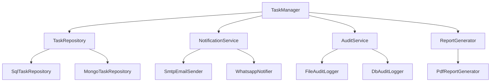
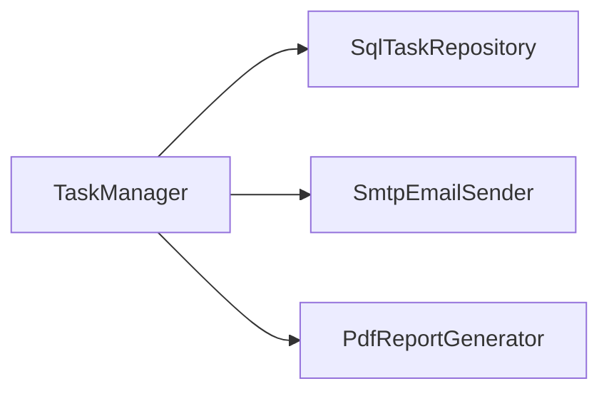
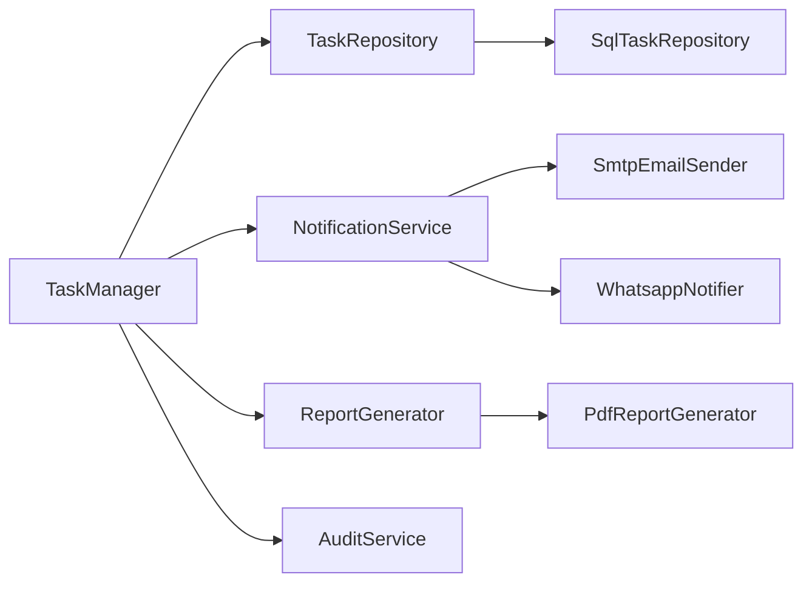

Agenda
======

<!-- incremental_lists: true -->

* Escenario actual
* Violaciones SOLID detectadas
* Rediseño propuesto
* Dependencias: antes vs después
* Patrones GoF aplicados
* Trade-offs y justificación
* ADR

<!--
speaker_note: |
  Hola a todos. El ejercicio de hoy parte de un componente real: el TaskManager. Vamos a aplicar principios SOLID, patrones GoF, y al final documentamos la decisión con un ADR.
  Vamos a recorrer rápidamente los temas. El enfoque es práctico: detectar problemas, proponer solución y justificar con trade-offs.
-->

<!-- end_slide -->

Escenario actual
================

**TaskManager** es un componente monolítico que concentra:

<!-- incremental_lists: true -->

* Crear y editar tareas
* Validar reglas de negocio
* Asignar usuarios
* Enviar notificaciones (email)
* Auditar cambios
* Persistir en base de datos
* Generar reportes PDF

<!-- pause -->

**Dependencias directas (concretas):**

```
SqlTaskRepository
SmtpEmailSender
PdfReportGenerator
```

**Nueva necesidad:** agregar notificación por WhatsApp y auditoría extendida.

<!--
speaker_note: |
  Aquí tenemos las 7 responsabilidades del TaskManager. Es un caso típico de "God Object" — un antipatrón documentado.
  ¿Alguien ha trabajado con un componente así? Seguramente sí — es muy común.
  Las 3 dependencias concretas son SqlTaskRepository, SmtpEmailSender y PdfReportGenerator. Y ahora nos piden agregar WhatsApp y auditoría extendida.
  Veamos qué principios se violan.
-->

<!-- end_slide -->

Violaciones SOLID — Resumen
===========================

| Principio | Violación |
|-----------|-----------|
| **S** — Single Responsibility | TaskManager tiene 7+ razones para cambiar |
| **O** — Open/Closed | Agregar WhatsApp requiere modificar código existente |
| **L** — Liskov Substitution | No hay abstracciones; no se pueden sustituir implementaciones |
| **I** — Interface Segregation | Una sola interfaz masiva expone todo a todos los consumidores |
| **D** — Dependency Inversion | Depende de clases concretas (Sql, Smtp, Pdf), no de abstracciones |

<!--
speaker_note: |
  Esta es la tabla resumen. No vamos a entrar en detalle todavía — cada principio tiene su propia slide.
  Lo importante aquí es que se violan los 5 principios SOLID. Eso es una señal clara de que el componente necesita rediseño.
-->

<!-- end_slide -->

SRP — Single Responsibility Principle
======================================

> *"Cada módulo debe tener una sola razón para cambiar."*

TaskManager viola SRP porque concentra responsabilidades no relacionadas:

| Responsabilidad | Razón para cambiar |
|-----------------|-------------------|
| Lógica de negocio (crear/editar/validar) | Cambian las reglas del dominio |
| Notificaciones (email) | Cambia el canal o el proveedor |
| Persistencia (SQL) | Cambia el motor de base de datos |
| Reportes (PDF) | Cambia el formato de salida |
| Auditoría | Cambian los requisitos de compliance |

**Señal de alerta:** un módulo que hace demasiadas cosas.

<!--
speaker_note: |
  El punto clave es que cada fila de la tabla representa una razón para cambiar independiente.
  Si cambian las reglas de notificación, no debería tocarse la lógica de persistencia.
  Un módulo que valida usuarios, envía correos y genera reportes viola este principio.
  Pero SRP no es la única violación...
-->

<!-- end_slide -->

OCP — Open/Closed Principle
============================

> *"Abierto para extensión, cerrado para modificación."*

**Problema actual:** agregar WhatsApp obliga a modificar TaskManager.

```java
// Antes: hay que tocar el TaskManager
class TaskManager {
    notify(task) {
        this.smtpSender.send(task);  // existente
        this.whatsapp.send(task);    // ← modifica código existente
    }
}
```

<!-- pause -->

**Lo que debería pasar:** agregar un canal nuevo sin tocar el código existente.

* El flujo de notificación debe ser **extensible** mediante nuevas implementaciones.
* El TaskManager no debería conocer cada canal específico.

<!--
speaker_note: |
  Miren el código. Agregar WhatsApp obliga a abrir y modificar TaskManager — eso viola OCP.
  Lo correcto sería agregar una nueva clase que implemente una interfaz de notificación, sin tocar el código existente.
  Observer y Strategy son justamente los patrones GoF que nos permiten cumplir OCP.
-->

<!-- end_slide -->

DIP — Dependency Inversion Principle
=====================================

> *"Los módulos de alto nivel no deben depender de módulos de bajo nivel. Ambos deben depender de abstracciones."*

**Problema actual:**

```
TaskManager (alto nivel)
    ├── SqlTaskRepository   (bajo nivel — concreto)
    ├── SmtpEmailSender     (bajo nivel — concreto)
    └── PdfReportGenerator  (bajo nivel — concreto)
```

* El **dominio** importa clases de **infraestructura**.
* No se puede reemplazar SQL por MongoDB sin reescribir TaskManager.
* No se puede probar el dominio sin la base de datos real.

<!--
speaker_note: |
  Este es el punto más importante del ejercicio.
  TaskManager es lógica de negocio — alto nivel — pero depende directamente de SqlTaskRepository, que es infraestructura de bajo nivel.
  El dominio importa clases de infraestructura — esa es una señal de alerta clara.
  La consecuencia es que no podemos probar el dominio sin la base de datos real, y no podemos migrar a MongoDB sin reescribir todo.
-->

<!-- end_slide -->

ISP + LSP — Violaciones adicionales
====================================

### ISP — Interface Segregation

* TaskManager expone una **interfaz masiva**: `create()`, `notify()`, `audit()`, `report()`, `persist()`...
* Un consumidor que solo necesita reportes se ve forzado a depender de toda la interfaz.
* **Solución:** interfaces segregadas por responsabilidad.

<!-- pause -->

### LSP — Liskov Substitution

* Al no existir abstracciones, **no hay nada que sustituir**.
* No se puede intercambiar `SmtpEmailSender` por `WhatsappNotifier` porque TaskManager depende de la clase concreta.
* **Solución:** definir contratos (interfaces) que toda implementación deba respetar.

<!--
speaker_note: |
  Sobre ISP: si un consumidor solo necesita generar reportes, no debería depender de una interfaz que incluye notify(), audit(), persist(). La solución es segregar interfaces.
  Sobre LSP: sin abstracciones no hay nada que sustituir — no podemos intercambiar SmtpEmailSender por WhatsappNotifier. La solución es definir contratos que toda implementación respete.
  ¿Cómo se ve el rediseño?
-->

<!-- end_slide -->

Rediseño propuesto
==================

Separar TaskManager en **componentes con responsabilidad única**, conectados por **abstracciones**:



Cada componente tiene **una sola razón para cambiar** y depende de **abstracciones**.

<!--
speaker_note: |
  En el diagrama vemos que TaskManager se convierte en un orquestador que depende de 4 interfaces: TaskRepository, NotificationService, AuditService y ReportGenerator.
  Cada interfaz tiene múltiples implementaciones. Esto permite agregar WhatsApp — una nueva implementación de NotificationService — sin tocar TaskManager.
-->

<!-- end_slide -->

Dependencias — Antes vs Después
================================

### Antes



Dependencias **directas y concretas**. Dominio acoplado a infraestructura.

<!-- end_slide -->

### Después



Dependencias apuntan hacia **abstracciones del dominio**. Inversión de dependencias.

<!--
speaker_note: |
  Comparemos ambos diagramas. Antes, las flechas van de TaskManager a clases concretas — dependencia directa.
  Después, las flechas van de las implementaciones concretas hacia las interfaces del dominio — inversión de dependencias.
  Las dependencias apuntan hacia el dominio, nunca al revés.
-->

<!-- end_slide -->

Patrones GoF aplicados
=======================

**Observer**
Notificaciones como observadores del evento `TaskCreated`
Protege: el evento frente a nuevas reacciones

**Strategy**
Canales y reportes como estrategias intercambiables
Protege: el flujo frente a reglas cambiantes

**Repository**
`TaskRepository` como abstracción de persistencia
Protege: el dominio de detalles de almacenamiento

**Decorator**
Auditoría como decorador que envuelve operaciones
Protege: la extensión sin modificar el componente base

> Observer no conecta objetos. Conecta eventos con consecuencias.

<!--
speaker_note: |
  Observer: cuando se crea una tarea, emite un evento; los notificadores son observadores que reaccionan independientemente.
  Strategy: cada canal de notificación es una estrategia intercambiable. Repository abstrae la persistencia.
  Decorator: la auditoría envuelve operaciones sin modificar el componente base.
  Observer no conecta objetos. Conecta eventos con consecuencias.
-->

<!-- end_slide -->

Trade-offs
==========

| Aspecto | Antes (monolítico) | Después (componentes) |
|---------|-------------------|----------------------|
| **Simplicidad inicial** | Mas simple | Mas archivos e interfaces |
| **Mantenibilidad** | Cambios rompen todo | Cambios localizados |
| **Testabilidad** | Requiere infraestructura real | Mocks por interfaz |
| **Extensibilidad** | Modificar para extender | Agregar implementaciones |
| **Complejidad estructural** | Baja | Mayor numero de componentes |

<!-- pause -->

> Toda decisión arquitectónica implica renunciar a algo.
> Aquí sacrificamos simplicidad inicial para ganar **evolución sostenible**.

<!--
speaker_note: |
  Hay que ser honestos con los costos. Sí, hay más archivos e interfaces. Sí, la complejidad estructural aumenta.
  Pero la mantenibilidad, testabilidad y extensibilidad mejoran significativamente.
  Toda decisión arquitectónica implica renunciar a algo. Aquí sacrificamos simplicidad inicial para ganar evolución sostenible.
-->

<!-- end_slide -->

ADR — Architecture Decision Record
====================================

**ADR-001: Refactorización de TaskManager hacia componentes SOLID**

**Contexto:**
TaskManager concentra 7 responsabilidades con dependencias concretas a infraestructura. Agregar WhatsApp y auditoría extendida requiere modificar código existente, violando OCP y DIP.

**Decisión:**
Separar TaskManager en componentes de responsabilidad única (persistencia, notificación, auditoría, reportes) conectados mediante interfaces. Aplicar Observer para notificaciones, Strategy para canales intercambiables, Repository para persistencia y Decorator para auditoría.

**Consecuencias:**

* (+) Extensibilidad: nuevos canales sin modificar código existente
* (+) Testabilidad: cada componente se prueba de forma aislada
* (+) Mantenibilidad: cambios localizados por componente
* (-) Mayor complejidad estructural inicial (más interfaces y clases)
* (-) Curva de aprendizaje para nuevos desarrolladores

<!--
speaker_note: |
  Este es el formato Nygard: Contexto, Decisión, Consecuencias. El ADR documenta la decisión para el futuro — cuando alguien pregunte "¿por qué se diseñó así?", la respuesta está aquí.
  El ADR vive en el repositorio junto al código. Eso es Docs-as-Code.
-->

<!-- end_slide -->

<!-- jump_to_middle -->

<!-- alignment: center -->

Gracias
=======

¿Preguntas?

<!--
speaker_note: |
  Gracias por su atención. ¿Tienen alguna pregunta?
  Algunas preguntas que pueden surgir: "¿Cuándo es excesivo aplicar SOLID?", "¿Cómo se maneja la inyección de dependencias?", "¿Qué pasa con el rendimiento al agregar tantas capas?"
  Tiempo total estimado: unos 20 minutos más preguntas y respuestas.
-->
